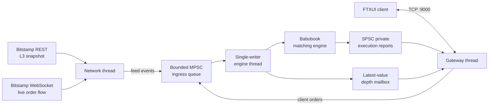

# Babo Exchange

A low-latency C++20 exchange simulator built around
[Babobook](https://github.com/zemi-taj-fromaz/babo_matching_engine). It
reconstructs a live BTC/USD level-3 order book from Bitstamp, combines venue
events and client orders into one deterministic matching stream, and exposes
market data and order entry through a native terminal client.

> [!NOTE]
> This project is under active development. It is an engineering and research
> project, not a production trading venue or financial product.

## Highlights

- Live Bitstamp BTC/USD level-3 snapshot and WebSocket order flow
- Deterministic, single-writer matching powered by Babobook
- Bounded MPSC ingress for feed and client-order producers
- Fixed-size events and preallocated bounded queues between worker threads
- Ordered private execution reports over an SPSC egress queue
- Consistent top-five depth publication through a latest-value mailbox
- Non-blocking TCP order gateway with per-client sessions
- Cross-platform FTXUI terminal client for depth, positions and order entry
- Fixed-point prices and quantities: two USD digits and eight BTC digits

## Architecture

The matching book is owned by one engine thread. Network and client threads
produce normalized events, but they never mutate the book directly. This keeps
matching deterministic and avoids locks inside the matching core.



At startup, the exchange:

1. Opens Bitstamp's live order stream and buffers incoming events.
2. Fetches an L3 REST snapshot of the BTC/USD book.
3. Seeds Babobook with the resting orders from that snapshot.
4. Applies buffered and subsequent live events through the same ingress path.
5. Publishes top-five depth and private client-order reports through the local
   TCP gateway.

## Repository layout

```text
.
|-- client/                 Native FTXUI trading client
|-- cmake/                  Dependency configuration
|-- docs/                   Protocol and venue notes
|-- libs/babobook/          Vendored matching-engine library
|-- src/
|   |-- core/               Process lifetime, sequencing and book ownership
|   |-- egress/             Depth snapshots and private execution reports
|   |-- feed/               Bitstamp REST/WebSocket integration
|   `-- gateway/            TCP sessions, commands and socket polling
`-- third_party/            Queue implementations and vendored dependencies
```

## Building

### Requirements

- A C++20 compiler
- CMake 3.20 or newer
- Git and an internet connection for CMake dependencies

The project is developed for Windows, Linux and macOS. The client is built by
default; disable it with `-DBABO_BUILD_CLIENT=OFF`.

```bash
cmake -S . -B build -DCMAKE_BUILD_TYPE=Release
cmake --build build --config Release --parallel
```

For multi-configuration generators such as Visual Studio, the executables are
normally placed under configuration-specific directories. For single-
configuration generators, they are typically available as:

```text
build/src/babo_exchange
build/client/babo_client
```

## Running

Start the exchange core first:

```bash
./build/src/babo_exchange
```

It connects to Bitstamp, reconstructs the BTC/USD book and opens the local order
gateway on `127.0.0.1:9000`.

Then start one or more clients:

```bash
./build/client/babo_client
```

The terminal client displays:

- Five levels of bid and ask depth
- Connection and market-data status
- Cash and BTC positions
- Active orders
- Accept, reject, fill, cancel and replace activity

The gateway accepts newline-delimited commands:

```text
buy <usd>                  market buy using a USD budget
sell <quantity>            market sell a BTC quantity
buy <quantity> <price>     limit buy
sell <quantity> <price>    limit sell
cancel <exchange-order-id>
```

The interactive client also provides conveniences such as `buy all`, `sell all`
and cancellation by the locally displayed order identifier.

## Design decisions

### Single-writer matching

Only the engine thread mutates the order book. Feed and gateway activity are
sequenced through a shared bounded queue, producing a total event order without
putting locks inside Babobook.

### Separate state-transfer mechanisms

Different output data has different delivery requirements:

- Private order reports are ordered events and use an SPSC queue.
- Public depth is replaceable state and uses a latest-value mailbox, allowing
  the gateway to skip stale intermediate snapshots while always reading a
  complete publication.

### Fixed-point values

Prices and quantities remain integers through the core:

- USD prices use two fractional digits.
- BTC quantities use eight fractional digits.

This avoids floating-point ambiguity in matching and order accounting.

### Explicit order identity

Bitstamp order IDs and locally generated client-order IDs occupy separate parts
of the 64-bit identifier space. This lets one book contain venue liquidity and
simulated client orders without identity collisions.

## Current scope

Implemented:

- Live Bitstamp L3 book synchronization
- Feed and client-order normalization
- Local client-versus-book matching
- Market and limit orders
- Order cancellation
- Private execution reports
- Top-five depth dissemination
- Native terminal client

Planned or still evolving:

- Batched engine-to-gateway egress
- Additional venues and replay/synthetic feed sources
- Broader automated test and benchmark coverage
- More complete order modification support in the client
- Production-grade persistence, authentication and risk controls

See [TODO.md](TODO.md) for the immediate engineering work.

## Related project

[babo_matching_engine](https://github.com/zemi-taj-fromaz/babo_matching_engine)
contains the reusable matching core and its correctness-verified benchmark
suite. Babo Exchange focuses on the system around that core: feed
synchronization, sequencing, networking, client sessions and market-data
delivery.
